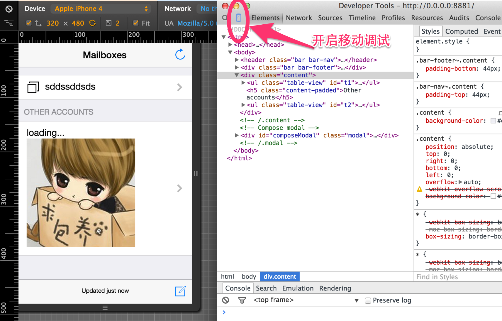

ratchet-practice
================

goratchet.com

## 它是？

它是twitter出的移动端h5框架。用于原型和快速开发。

## 优势

- 快速开发
- 小巧
- 和bootstrap思路相近
- 便于定制和集成


## Run && Test

```
npm install 
npm start
```

this will open `http://0.0.0.0:8881/index.html`


默认，ratchet是不支持pc浏览器的click事件的，所以我们需要【开启移动测试】



然后就可以尽情测试了。

## push

原理：已数据结构【栈】的方式存放nav导航页面。

核心技术

- ajax （加载页面）
- pushstate （改变url状态）

## push css

### 入栈

```
<a class="navigate-right" href="chat.html" data-transition="slide-in">
```

### 出栈

```
<a class="icon icon-left-nav pull-left" href="index.html" data-transition="slide-out"></a>
```

### 动画类型

data-transition是push的时候的动画

```
  var transitionMap  = {
    slideIn  : 'slide-out',
    slideOut : 'slide-in',
    fade     : 'fade'
  };
```

## push js

默认不写任何js代码就可以完成push的，但是高级定制的是一定要了解每个页面入栈和出栈的生命周期的

这方面ratchet表现的很弱，但可以实现

### 状态切换

```
window.addEventListener('push', function(e){
	$("#t2").show();
	// alert(111);
	var url = e.detail.state.url;

	if(case_one(url,/chat\.html/g)){
		console.log("聊天");
		// init_with_chat();
	}

	if(case_one(url,/index\.html/g)){
		console.log("首页");
		// $('.content').html(index_content)		
	}

	function case_one(url, pattern){
		return (url.match(pattern)) instanceof Array;
	}
});

```

更多见源码里的push.js，当它完成push的时候，会发送一个自定义事件push的。


### 手动调用

另外可以手动调用的。见源码：

```
window.PUSH = PUSH;
```

## push的弊端

页面动态是非常头疼的问题，此处还是建议使用服务器端生成页面，不要ajax本地拼装，效果太差了。

推荐方案

- express + jade

- 动态的内容，使用jade来生成，此法可根据参数以及个人信息等定制，是服务器端生成的html页面
- 静态页面可仍然使用html编写，放到express的public目录下

上面的2种方式可以任意组合，可以胜任各种场景。


- jade学习文档 https://github.com/i5ting/study-jade

